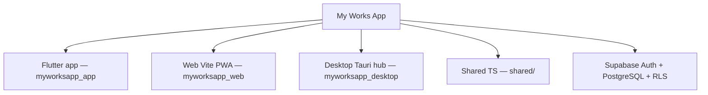

# My Works App — Ecosistema multiplataforma (MVP)

[]()
[]()
[]()

Marketplace de servicios del hogar (cliente + profesional) para Chile, con hub web y escritorio admin.  
**Estado:** listo para lanzar comercial con Webpay en integración; flip a producción al crear la empresa (ver runbook Transbank).

Documento técnico de referencia: [`ESTADO_DEL_PROYECTO.md`](ESTADO_DEL_PROYECTO.md).

---

## Estructura del monorepo



| Carpeta | Rol |
|---------|-----|
| `myworksapp_app/` | App principal Flutter (usuario, trabajador, admin) |
| `myworksapp_web/` | Landing / flujo cliente web |
| `myworksapp_desktop/` | Hub operativo admin (Tauri) |
| `shared/` | Auth y repositorios TypeScript compartidos (web/desktop) |
| `myworksapp_app/supabase/migrations/` | Migraciones de hardening (el schema base vive en el proyecto Supabase) |

---

## Qué es real vs demo

| Capacidad | Realidad |
|-----------|----------|
| Auth Supabase + perfiles / roles | Real |
| Jobs, matching, estado de trabajos (Flutter) | Real (con reglas de dominio) |
| Escrow / pagos | **Webpay Plus** (integración Transbank; flip a prod vía secrets) |
| GPS en vivo (web) | **Simulado** (animación UI) |
| Firma “SHA-256 / Ley 19.799” (desktop) | **Demo** (no es firma criptográfica legal) |
| DevSecOps “test runner 1-click” | **Demo UI** (no ejecuta suites reales) |
| CSAT 99.4% / GMV $14.85M | **Datos de ejemplo**, no métricas medidas |
| Stress tests 15k VUs | **No hay scripts** de carga en este repo |
| Tests automatizados | Flutter unit/widget; web/desktop sin suite aún |

---

## Ejecución local

### Variables de entorno

Copia los ejemplos y completa con tu proyecto Supabase:

```bash
cp myworksapp_web/.env.example myworksapp_web/.env
cp myworksapp_desktop/.env.example myworksapp_desktop/.env
```

Flutter (opcional, recomendado en CI):

```bash
flutter run --dart-define=SUPABASE_URL=https://xxx.supabase.co --dart-define=SUPABASE_ANON_KEY=sb_publishable_...
```

### Web

```bash
cd myworksapp_web
npm install
npm run dev -- --port 3000
```

### Desktop hub

```bash
cd myworksapp_desktop
npm install
npm run tauri:dev
```

### Flutter

```bash
cd myworksapp_app
flutter pub get
flutter test
flutter run
```

Cuentas demo **solo staging/debug** (nunca en release UI): ver `DEMO.md`. Runbook Webpay: [`docs/RUNBOOK_TRANSBANK_PRODUCCION.md`](docs/RUNBOOK_TRANSBANK_PRODUCCION.md).

---

## Calidad y CI

- Flutter: `flutter analyze` + `flutter test` (`.github/workflows/flutter_ci.yml`)
- Web/desktop: lint + build; Tauri build en Windows (`.github/workflows/web_desktop_ci.yml`)
- Gitleaks, Scorecard, commitlint y keepalive de Supabase (requiere secrets `SUPABASE_URL` / `SUPABASE_ANON_KEY`)

Pre-commit local: ver `.pre-commit-config.yaml`.

---

## Licencia

Proyecto académico / demo. Todos los derechos reservados salvo acuerdo distinto.
