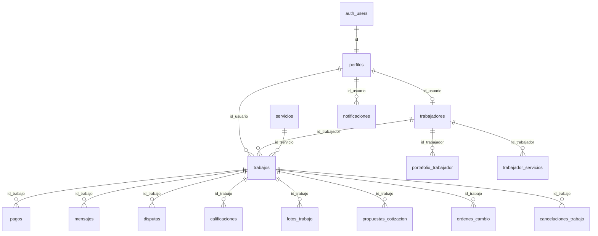

# Diccionario de Base de Datos — MyWorksApp

| Campo | Valor |
|-------|--------|
| Proyecto | MyWorksApp (Supabase `wxqrfcqifkfgawrnqmnj`) |
| Motor | PostgreSQL (Supabase) |
| Convención | español + `snake_case` |
| Estado remoto | Rename ES (`04`) + catálogo (`02`); RLS (`05`) **pendiente de confirmar en nube** |
| Versión documento | 1.1 — 2026-09-14 |
| Tipado | Híbrido: algunos IDs `uuid`, otros `text`; bools como `int` 0/1; fechas a menudo text ISO |

## 1. Propósito

Contrato canónico del esquema `public` para las aplicaciones móvil (Flutter), web (React) y escritorio (Tauri/React). Documenta tablas, columnas, códigos de dominio, FKs lógicas, triggers, RLS y consumidores.

## 2. Diagrama entidad-relación (simplificado)

## 3. Inventario de tablas (28)

| # | Tabla | Origen EN | Propósito |
|---|--------|-----------|-----------|
| 1 | perfiles | profiles | Identidad de app ligada a Auth |
| 2 | trabajadores | workers | Perfil profesional 1:1 |
| 3 | servicios | services | Catálogo de oficios |
| 4 | trabajos | jobs | Solicitud y ciclo de vida |
| 5 | pagos | payments | Escrow / pagos (simulación de pasarela en clientes) |
| 6 | mensajes | messages | Chat por trabajo |
| 7 | disputas | disputes | Conflictos |
| 8 | notificaciones | notifications | Inbox / Realtime |
| 9 | calificaciones | ratings | Puntaje 1–5 |
| 10 | reportes | reports | Denuncias |
| 11 | propuestas_cotizacion | quote_proposals | Cotizaciones |
| 12 | ordenes_cambio | change_orders | Extras / alcance |
| 13 | fotos_trabajo | job_photos | Evidencia media |
| 14 | portafolio_trabajador | worker_portfolio | Galería profesional |
| 15 | trabajador_servicios | worker_services | N:M categorías |
| 16 | cancelaciones_trabajo | job_cancellations | Auditoría de cancelación |
| 17 | registros_error_app | app_error_logs | Errores cliente |
| 18 | eventos_abuso | abuse_events | Antiabuso |
| 19 | acciones_pendientes | pending_actions | Sync offline |
| 20 | bloqueos_usuario | user_blocks | Bloqueos |
| 21 | consentimientos_usuario | user_consents | GDPR / términos |
| 22 | banderas_funcionalidad | feature_flags | Feature flags |
| 23 | suscripciones | subscriptions | Planes |
| 24 | impulsos | boosts | Boost de visibilidad |
| 25 | eventos_analitica | analytics_events | Product analytics |
| 26 | configuraciones_servicio | service_configs | Schema UI servicio |
| 27 | codigos_restablecimiento | password_reset_codes | Reset password app |
| 28 | tickets_soporte | tickets | Soporte / desk |

## 4. Glosario de códigos

| Dominio | Valores |
|---------|---------|
| Rol | `usuario`, `trabajador`, `administrador` (`is_admin` acepta también `admin`) |
| Estado cuenta | `activo`, `suspendido`, `bloqueado`, `eliminado` |
| Estado trabajo | `pendiente`, `aceptado`, `en_curso`, `completado`, `cancelado`, `expirado`, `no_asistio`, `esperando_pago`, `esperando_cotizaciones`, `cotizacion_seleccionada`, `pausado_orden_cambio`, `esperando_aprobacion_cliente` |
| Estado pago | `ninguno`, `pendiente`, `autorizado`, `retenido`, `liberado`, `reembolsado` |
| Modalidad cobro | `legado`, `precio_fijo`, `bloque_horas`, `cotizacion_abierta` |
| Tipo pago | `principal`, `orden_cambio`, `horas_extra` |
| Disputa estado | `abierta`, `en_revision`, `resuelta` |
| Disputa motivo | `calidad`, `pago`, `conducta`, `otro` |
| Reporte | `pendiente`, `revisado`, `resuelto`, `descartado` |
| Categoría | `construccion`, `plomeria`, `electricidad`, `limpieza`, `ensamblaje`, `soporte_tecnico`, `jardinera`, `mudanza`, `general` |
| Modelo precio | `por_hora`, `fijo`, `por_item` |
| Cotización | `enviada`, `retirada`, `aceptada`, `rechazada` |
| Orden cambio | `pendiente_cliente`, `aprobada`, `rechazada`, `pagada`, `cancelada` |
| Mensaje / medio | `texto`/`imagen` · `foto`/`video` |
| Error / sync | `nuevo`…`ignorado` · `pendiente_sync`…`fallido` |
| Suscripción / impulso | `activa`/`cancelada`/`expirada` · `visibilidad`/`prioridad`/`destacado` |
| Ticket | `pendiente`, `resuelto` |

## 5. Tablas núcleo

### 5.1 perfiles

| Columna | Tipo lógico | Nulo | Descripción |
|---------|-------------|------|-------------|
| id | uuid (típ.) | No | PK = auth.users.id |
| nombre | text | No | Nombre visible |
| correo | text | No | Email |
| rol | text | No | Ver glosario |
| estado_cuenta | text | No | Ver glosario |
| ruta_foto_perfil | text | Sí | URL/ruta |
| creado_en | text/timestamptz | No | Alta |

**FK:** id → auth.users · **Índice:** idx_perfiles_rol  
**Triggers:** handle_new_user; protect_profiles_sensitive

### 5.2 trabajadores

| Columna | Tipo | Descripción |
|---------|------|-------------|
| id_usuario | PK/FK → perfiles | uuid típ. |
| profesion | text | Oficio |
| descripcion | text | Bio |
| calificacion | numeric | Rating agregado |
| disponible | int 0/1 | Disponibilidad |
| tarifa_visita | numeric | CLP |
| categoria_servicio | text | Categoría |
| niveles_precio | json | Tiers |
| servicios_personalizados | json | Extra |
| precios_configurados | int 0/1 | Setup OK |
| zona_trabajo | text | Zona |
| conteo_rechazos | int | Ranking |

**FK:** trabajadores_id_usuario_fkey

### 5.3 servicios

id, nombre, descripcion, categoria, activo, requiere_certificacion, modelo_precio, aviso_legal, creado_en, actualizado_en.

### 5.4 trabajos

id (a menudo **text**), id_usuario, id_trabajador, id_servicio, estado, direccion, latitud, longitud, descripcion, fecha_programada, metadatos_servicio, modalidad_cobro, estado_pago, id_comuna, instantanea_precio, id_sku_servicio, horas_bloque, id_cotizacion_seleccionada, creado_en, actualizado_en.

### 5.5–5.10

- **pagos:** id_trabajo, tipo_pago, monto, moneda, estado, metodo_pago, id_transaccion, timestamps escrow  
- **mensajes:** id_trabajo, id_remitente, id_destinatario, contenido, tipo, ruta_imagen, leido, creado_en  
- **disputas:** id_trabajo, abierta_por, motivo, descripcion, estado, resolucion, resuelta_por, resuelta_en  
- **notificaciones:** id_usuario, tipo (códigos evento aún EN), titulo, cuerpo, id_relacionado, leido  
- **calificaciones:** id_trabajo, id_usuario, puntaje 1–5, comentario  
- **reportes:** id_reportante, id_usuario_reportado, motivo, descripcion, estado  

## 6. Tablas secundarias

propuestas_cotizacion, ordenes_cambio, fotos_trabajo, portafolio_trabajador, trabajador_servicios, cancelaciones_trabajo, registros_error_app, eventos_abuso, acciones_pendientes, bloqueos_usuario, consentimientos_usuario, banderas_funcionalidad, suscripciones, impulsos, eventos_analitica, configuraciones_servicio, codigos_restablecimiento, tickets_soporte.

## 7. Seguridad versionada (migración 05)

| Artefacto | Efecto |
|-----------|--------|
| is_admin() | perfiles.rol admin/administrador + cuenta activa |
| es_parte_trabajo(text) | Parte del trabajo (cliente/trabajador) o admin; compara IDs con `::text` |
| RLS | ENABLE en 28 tablas; policies por propio / parte / admin / marketplace |
| admin_metricas_resumen() | JSON métricas; solo admin |
| admin_actualizar_estado_disputa(text,text,text) | Resolución disputa; solo admin |
| handle_new_user / protect_profile_sensitive | Signup seguro + campos sensibles |

**Nota tipado:** las policies usan `columna::text = auth.uid()::text` porque el esquema mezcla uuid y text.

## 8. Consumidores

| App | Uso principal |
|-----|----------------|
| Flutter | Repositories sobre casi todas las tablas |
| Web + shared | Catálogo, trabajadores, trabajos; pagos UI simulada |
| Desktop + shared | Disputas/métricas vía RPC; paneles DEMO etiquetados |

## 9. Gaps residuales

| Gap | Severidad | Estado |
|-----|-----------|--------|
| Confirmar RLS 05 en remoto | Alta | Script en repo; aplicar en SQL Editor |
| Tipado híbrido uuid/text | Media | Documentado; dumps CREATE TABLE históricos ausentes |
| Códigos notificación/abuso EN | Baja | Sin migrar a ES |
| service_pricing | Baja | Model sin tabla en rename |
| Flutter publishable key en código | Media | Web/desktop usan .env |

## 10. Referencias

- mapa_esquema_en_es.md  
- APLICAR_MIGRACION_ES.md  
- Migraciones: `20260914000004_aplicar_rename_es.sql`, `…02_catalogo…`, `…05_rls…`  
- AUDITORIA_PROYECTO.md  
- Word: `docs/DICCIONARIO_BASE_DATOS.docx`
