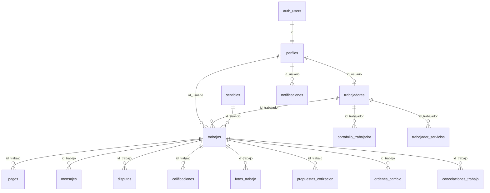

# Diccionario de Base de Datos — MyWorksApp

| Campo | Valor |
|-------|--------|
| Proyecto | MyWorksApp (Supabase `wxqrfcqifkfgawrnqmnj`) |
| Motor | PostgreSQL (Supabase) |
| Convención | español + `snake_case` |
| Estado remoto | Rename ES (`04`) **aplicado**; RLS (`05`) **confirmado** en tablas núcleo; seed marketplace (`06`) en repo |
| Versión documento | **1.4** — 2026-09-14 (español neutro) |
| Tipado | Híbrido: algunos IDs `uuid`, otros `text`; booleanos como `int` 0/1; fechas a menudo text ISO |

Antes de revisar las tablas: este documento es el mapa de la base de datos que utilizan la aplicación Flutter, la web y el escritorio. Si alguien del equipo pregunta «¿dónde se guarda X?» o «¿por qué el rol se llama así?», la respuesta debería estar aquí. Lo técnico se mantiene tal cual; bajo cada bloque se explica el significado práctico.

Atención al tipado híbrido: no todo es `uuid` limpio ni boolean real. Se observará `disponible = 1`, fechas como texto ISO e IDs de trabajo que a veces son `text`. No es un error de nomenclatura: el esquema creció de esa forma y las políticas RLS comparan casi todo con `::text` para no romper compatibilidad.

## 1. Propósito

Contrato canónico del esquema `public` para las aplicaciones móvil (Flutter), web (React) y escritorio (Tauri/React). Documenta tablas, columnas, códigos de dominio, claves foráneas lógicas, triggers, RLS y consumidores.

En términos simples: si se cambia un nombre de columna o un estado (`pendiente` → otro valor) sin actualizar este documento y el código, se rompe el flujo. Este archivo es la referencia compartida para no inventar nombres distintos entre aplicaciones.

## 2. Diagrama entidad-relación (simplificado)

Cómo se leen las flechas: casi todo parte de `auth.users` → `perfiles`. Si la persona es profesional, tiene fila en `trabajadores`. Cuando alguien solicita un servicio nace un registro en `trabajos`, y de ahí dependen pagos, chat, disputas, fotos, etc. El diagrama no lista las 28 tablas; es el esqueleto para orientarse.

## 3. Inventario de tablas (28)

Son 28 tablas en `public`. La columna «Origen EN» es el nombre anterior en inglés (antes del rename). Si alguien busca en un tutorial o en un commit antiguo `profiles` / `jobs`, aquí se indica a qué tabla pasó.

| # | Tabla | Origen EN | Propósito |
|---|--------|-----------|-----------|
| 1 | perfiles | profiles | Identidad de app ligada a Auth |
| 2 | trabajadores | workers | Perfil profesional 1:1 |
| 3 | servicios | services | Catálogo de oficios |
| 4 | trabajos | jobs | Solicitud y ciclo de vida |
| 5 | pagos | payments | Escrow / pagos (simulación de pasarela en clientes) |
| 6 | mensajes | messages | Chat por trabajo |
| 7 | disputas | disputes | Conflictos |
| 8 | notificaciones | notifications | Bandeja / Realtime |
| 9 | calificaciones | ratings | Puntaje 1–5 |
| 10 | reportes | reports | Denuncias |
| 11 | propuestas_cotizacion | quote_proposals | Cotizaciones |
| 12 | ordenes_cambio | change_orders | Extras / alcance |
| 13 | fotos_trabajo | job_photos | Evidencia multimedia |
| 14 | portafolio_trabajador | worker_portfolio | Galería profesional |
| 15 | trabajador_servicios | worker_services | N:M categorías |
| 16 | cancelaciones_trabajo | job_cancellations | Auditoría de cancelación |
| 17 | registros_error_app | app_error_logs | Errores de cliente |
| 18 | eventos_abuso | abuse_events | Antiabuso |
| 19 | acciones_pendientes | pending_actions | Sync offline |
| 20 | bloqueos_usuario | user_blocks | Bloqueos |
| 21 | consentimientos_usuario | user_consents | GDPR / términos |
| 22 | banderas_funcionalidad | feature_flags | Feature flags |
| 23 | suscripciones | subscriptions | Planes |
| 24 | impulsos | boosts | Impulso de visibilidad |
| 25 | eventos_analitica | analytics_events | Analítica de producto |
| 26 | configuraciones_servicio | service_configs | Schema UI de servicio |
| 27 | codigos_restablecimiento | password_reset_codes | Restablecimiento de contraseña en app |
| 28 | tickets_soporte | tickets | Soporte / mesa de ayuda |

Las primeras 10 son las que más se utilizan en el día a día (cuenta, oficio, pedido, pagos, chat). Del 11 al 16 corresponden al flujo de cotización / evidencia / cancelación. Del 17 al 28 son soporte, cumplimiento, flags y funciones de producto que a veces permanecen poco activas en la demo, aunque la tabla exista.

## 4. Glosario de códigos

Estos strings viven en columnas `text`. No son enums de Postgres rígidos en todos los casos: si se envía un valor inventado, a veces la base lo acepta y el error aparece en la interfaz. Al programar un filtro o un `if`, deben usarse exactamente estos valores.

| Dominio | Valores |
|---------|---------|
| Rol | `usuario`, `trabajador`, `administrador` (`is_admin` acepta también `admin`) |
| Estado cuenta | `activo`, `suspendido`, `bloqueado`, `eliminado` |
| Estado trabajo | `pendiente`, `aceptado`, `en_curso`, `completado`, `cancelado`, `expirado`, `no_asistio`, `esperando_pago`, `esperando_cotizaciones`, `cotizacion_seleccionada`, `pausado_orden_cambio`, `esperando_aprobacion_cliente` |
| Estado pago | `ninguno`, `pendiente`, `autorizado`, `retenido`, `liberado`, `reembolsado` |
| Modalidad cobro | `legado`, `precio_fijo`, `bloque_horas`, `cotizacion_abierta` |
| Tipo pago | `principal`, `orden_cambio`, `horas_extra` |
| Disputa estado | `abierta`, `en_revision`, `resuelta` |
| Disputa motivo | `calidad`, `pago`, `conducta`, `otro` |
| Reporte | `pendiente`, `revisado`, `resuelto`, `descartado` |
| Categoría | `construccion`, `plomeria`, `electricidad`, `limpieza`, `ensamblaje`, `soporte_tecnico`, `jardinera`, `mudanza`, `general` |
| Modelo precio | `por_hora`, `fijo`, `por_item` |
| Cotización | `enviada`, `retirada`, `aceptada`, `rechazada` |
| Orden cambio | `pendiente_cliente`, `aprobada`, `rechazada`, `pagada`, `cancelada` |
| Mensaje / medio | `texto`/`imagen` · `foto`/`video` |
| Error / sync | `nuevo`…`ignorado` · `pendiente_sync`…`fallido` |
| Suscripción / impulso | `activa`/`cancelada`/`expirada` · `visibilidad`/`prioridad`/`destacado` |
| Ticket | `pendiente`, `resuelto` |

Uso habitual en el proyecto:

- **Rol:** el cliente ingresa como `usuario`, el profesional como `trabajador`, la consola de escritorio solo admite `administrador`. `is_admin()` también acepta `admin` por si quedó algún registro antiguo.
- **Estado cuenta:** si no está `activo`, no debería operar con normalidad (inicio de sesión / controles en la app).
- **Estado trabajo:** es la máquina de estados del pedido. `pendiente` = recién solicitado; `en_curso` = en ejecución; `esperando_pago` / cotizaciones aparecen en modalidades nuevas de cobro.
- **Estado pago / escrow:** en los clientes es simulación académica (no hay pasarela real cobrando). Aun así se persisten estados para demostrar el flujo.
- **Categoría:** es el identificador estable del oficio (`plomeria`, no un título comercial largo). El nombre visible va en `servicios.nombre`.

## 5. Tablas núcleo

### 5.1 perfiles

Ficha de la persona en la aplicación. Auth de Supabase proporciona el usuario; aquí se guardan nombre, correo, rol y si la cuenta es usable. El `id` es el mismo que `auth.users.id`: si no coincide, el perfil no corresponde a ese inicio de sesión.

| Columna | Tipo lógico | Nulo | Descripción |
|---------|-------------|------|-------------|
| id | uuid (típ.) | No | PK = auth.users.id |
| nombre | text | No | Nombre visible |
| correo | text | No | Correo electrónico |
| rol | text | No | Ver glosario |
| estado_cuenta | text | No | Ver glosario |
| ruta_foto_perfil | text | Sí | URL/ruta |
| creado_en | text/timestamptz | No | Alta |

**FK:** id → auth.users · **Índice:** idx_perfiles_rol  
**Triggers:** handle_new_user; protect_profiles_sensitive  
**RLS remoto:** `rowsecurity = true` (confirmado 2026-09-14)

`handle_new_user` crea el perfil cuando alguien se registra. `protect_profiles_sensitive` evita que un usuario se autoasigne rol de administrador u otros campos que no le corresponden. Con RLS, en principio cada uno ve y edita lo suyo (y el administrador, más).

### 5.2 trabajadores

No todo registro en `perfiles` es trabajador. Solo si ofrece oficios hay fila aquí, 1:1 con el usuario (`id_usuario`). Aquí están la biografía, la disponibilidad, la tarifa de visita, la zona, los niveles de precio en JSON, etc. El inicio del profesional y el listado del marketplace leen con intensidad esta tabla.

| Columna | Tipo | Descripción |
|---------|------|-------------|
| id_usuario | PK/FK → perfiles | uuid típ. |
| profesion | text | Oficio |
| descripcion | text | Biografía |
| calificacion | numeric | Rating agregado |
| disponible | int 0/1 | Disponibilidad |
| tarifa_visita | numeric | CLP |
| categoria_servicio | text | Categoría |
| niveles_precio | json | Niveles / packs |
| servicios_personalizados | json | Extra |
| precios_configurados | int 0/1 | Configuración completada |
| zona_trabajo | text | Zona |
| conteo_rechazos | int | Ranking |

**FK:** trabajadores_id_usuario_fkey  
**RLS remoto:** `rowsecurity = true` (confirmado 2026-09-14)  
**Marketplace (`06`):** `SELECT` permitido a `anon` + `authenticated`

`disponible = 1` significa que pueden contactarlo / se muestra disponible. `precios_configurados = 1` indica que ya completó la configuración de tarifas. `niveles_precio` es JSON a propósito: cada oficio arma paquetes distintos sin una tabla rígida por ítem.

### 5.3 servicios

Catálogo de oficios que muestra la aplicación (plomería, electricidad, etc.). Si esta tabla está vacía, el inicio del cliente no tiene qué listar aunque existan trabajadores. Por eso existe la migración `06` de datos semilla.

| Columna | Tipo | Descripción |
|---------|------|-------------|
| id | text/uuid | PK |
| nombre | text | Nombre del oficio |
| descripcion | text | Detalle |
| categoria | text | Ver glosario (clave lógica de seed) |
| activo | int 0/1 | Visible en catálogo si = 1 |
| requiere_certificacion | int 0/1 | p. ej. electricidad |
| modelo_precio | text | `por_hora` / `fijo` / `por_item` |
| aviso_legal | text | Aviso / disclaimer |
| creado_en / actualizado_en | text ISO | Auditoría |

**RLS remoto:** `rowsecurity = true` (confirmado 2026-09-14)  
**Seed (`06`):** 8 categorías (`svc-plomeria` … `svc-construccion`) si la tabla estaba vacía  
**Marketplace:** `SELECT` de activos a `anon`/`authenticated` (sin invocar `is_admin` en la política pública)

`categoria` es la clave estable para unir o filtrar. `nombre` es lo que lee el usuario. `activo = 0` retira el oficio del catálogo sin borrar la fila. La política pública no llama a `is_admin()` porque el rol `anon` no puede ejecutar esa función y produce el error `42501`.

### 5.4 trabajos

El pedido en sí: quién lo solicitó, qué profesional quedó asignado (si hay), qué servicio, dirección, estado, modalidad de cobro, etc. Casi todos los flujos activos de la aplicación giran en torno a esta tabla.

id (a menudo **text**), id_usuario, id_trabajador, id_servicio, estado, direccion, latitud, longitud, descripcion, fecha_programada, metadatos_servicio, modalidad_cobro, estado_pago, id_comuna, instantanea_precio, id_sku_servicio, horas_bloque, id_cotizacion_seleccionada, creado_en, actualizado_en.

**RLS remoto:** `rowsecurity = true` (confirmado 2026-09-14)

`id_usuario` = cliente. `id_trabajador` = profesional (puede ser null mientras busca / cotiza). `metadatos_servicio` e `instantanea_precio` guardan lo pactado para no depender solo del catálogo actual. Si el `id` del trabajo es `text`, no se debe asumir uuid en el código ni en las RPC: por eso `es_parte_trabajo(p_trabajo_id text)`.

### 5.5 pagos

Registro de cobro / escrow ligado a un trabajo. En la demostración académica la interfaz indica simulación: no hay conexión a Transbank/Stripe cobrando de verdad, pero la fila y los estados sirven para mostrar el flujo (retenido → liberado, etc.). Tras el hardening, las transiciones de estado de pago deben hacerse por RPC mock (`simular_transicion_pago`), no por `UPDATE` directo del cliente.

id_trabajo, tipo_pago, monto, moneda, estado, metodo_pago, id_transaccion, timestamps de escrow.

**RLS remoto:** `rowsecurity = true` (confirmado 2026-09-14)  
**Acceso:** solo `authenticated` parte del trabajo o administrador (no `anon`)

Si se prueba con la clave anon sin inicio de sesión y se obtiene 401 o vacío, es el comportamiento esperado. Pagos y chat no son catálogo público.

### 5.6–5.10

- **mensajes:** id_trabajo, id_remitente, id_destinatario, contenido, tipo, ruta_imagen, leido, creado_en  
- **disputas:** id_trabajo, abierta_por, motivo, descripcion, estado, resolucion, resuelta_por, resuelta_en  
- **notificaciones:** id_usuario, tipo (códigos de evento aún EN), titulo, cuerpo, id_relacionado, leido  
- **calificaciones:** id_trabajo, id_usuario, puntaje 1–5, comentario  
- **reportes:** id_reportante, id_usuario_reportado, motivo, descripcion, estado  

El chat (`mensajes`) es por trabajo, no una bandeja global suelta. Las disputas las abre una de las partes y las cierra soporte/administrador (el escritorio usa RPC). Notificaciones: el campo `tipo` todavía puede venir en inglés de cuando el esquema era EN; el resto del esquema ya está en español. Las calificaciones alimentan el `calificacion` del trabajador. Los reportes son denuncias entre usuarios para moderación.

## 6. Tablas secundarias

propuestas_cotizacion, ordenes_cambio, fotos_trabajo, portafolio_trabajador, trabajador_servicios, cancelaciones_trabajo, registros_error_app, eventos_abuso, acciones_pendientes, bloqueos_usuario, consentimientos_usuario, banderas_funcionalidad, suscripciones, impulsos, eventos_analitica, configuraciones_servicio, codigos_restablecimiento, tickets_soporte.

La migración `05` habilita RLS en el inventario completo cuando la tabla existe.

Para ubicarlas sin memorizarlas:

- **propuestas_cotizacion / ordenes_cambio:** precio abierto y cambios de alcance con cobro adicional.
- **fotos_trabajo / portafolio_trabajador:** evidencia del trabajo frente a la galería del perfil.
- **trabajador_servicios:** cruza profesional ↔ categorías (N:M).
- **cancelaciones_trabajo:** historial de por qué se canceló un trabajo.
- **registros_error_app / eventos_abuso / acciones_pendientes:** telemetría, antiabuso y cola offline.
- **bloqueos_usuario / consentimientos_usuario:** seguridad interpersonal y GDPR/términos.
- **banderas_funcionalidad / suscripciones / impulsos / eventos_analitica:** producto (flags, planes, impulso, analítica).
- **configuraciones_servicio:** cómo se arma el formulario de interfaz por oficio.
- **codigos_restablecimiento:** restablecimiento de contraseña por la aplicación (además de lo que haga Auth).
- **tickets_soporte:** mesa de ayuda.

## 7. Seguridad versionada

RLS = Row Level Security: aunque se tenga la clave anon/publicable, Postgres filtra filas según políticas. Sin eso, cualquiera con la clave podría leer de más. Las migraciones `05` y `06` (y el hardening `20260915`) dejan esto usable en el entorno remoto.

### 7.1 Migración 05 — helpers, RLS, RPC

| Artefacto | Efecto |
|-----------|--------|
| is_admin() | perfiles.rol admin/administrador + cuenta activa; **EXECUTE** solo `authenticated` |
| es_parte_trabajo(text) | Parte del trabajo (cliente/trabajador) o administrador; compara IDs con `::text` |
| RLS | ENABLE en hasta 28 tablas; políticas por propio / parte / administrador |
| admin_metricas_resumen() | JSON de métricas; solo administrador |
| admin_actualizar_estado_disputa(text,text,text) | Resolución de disputa; solo administrador |
| handle_new_user / protect_profile_sensitive | Registro seguro + campos sensibles |

**Nota de tipado:** las políticas usan `columna::text = auth.uid()::text` porque el esquema mezcla uuid y text.

Si se invocan las RPC de administrador sin sesión de administrador, se observará un error del tipo «Solo administradores» (en HTTP suele ser 400, no 404). Un 404 indicaría que la función no existe: en ese caso falta aplicar `05`.

### 7.2 Confirmación remota RLS (2026-09-14)

Verificado por el equipo en el Editor SQL:

| tablename | rowsecurity |
|-----------|-------------|
| pagos | true |
| perfiles | true |
| servicios | true |
| trabajadores | true |
| trabajos | true |

`rowsecurity = true` significa que RLS está activado en esa tabla. No implica que todas las políticas sean perfectas para siempre, pero sí que ya no es una tabla abierta sin filtro.

### 7.3 Migración 06 — seed + marketplace

- Inserta 8 oficios si faltan por `categoria`
- `GRANT SELECT` de marketplace a `anon`/`authenticated` en `servicios` y `trabajadores`
- `GRANT` de escritura en tablas sensibles **solo** a `authenticated`
- Política pública de `servicios` **no** llama a `is_admin()` (evita `42501 permission denied for function is_admin` en anon)

La página de inicio web necesita ver catálogo y profesionales sin inicio de sesión. Eso es SELECT de marketplace, no abrir `pagos`/`mensajes` al público. Si después de `06` algo del catálogo falla por `is_admin`, debe reaplicarse el bloque de políticas de `servicios` del archivo (versión corregida).

## 8. Consumidores

| App | Uso principal |
|-----|----------------|
| Flutter | Repositories sobre casi todas las tablas; release exige `--dart-define` Supabase |
| Web + shared | Catálogo, trabajadores, trabajos; pagos UI simulada |
| Desktop + shared | Disputas/métricas vía RPC; paneles DEMO etiquetados |

Flutter es el cliente completo. Web es marketplace + reserva. Escritorio es operaciones (soporte/ejecutivo) y tiene paneles demo académicos aparte: no deben confundirse con datos productivos. El paquete `shared` concentra llamadas RPC de métricas/disputas para web y escritorio.

## 9. Gaps residuales

Aspectos que aún conviene tener presentes; no significan que el diccionario esté incorrecto, sino deuda conocida.

| Gap | Severidad | Estado |
|-----|-----------|--------|
| RLS 05 en tablas núcleo | Alta | **Cerrado** (confirmado remoto 2026-09-14) |
| Catálogo `servicios` vacío / política anon | Alta | Mitigado con `06`; reaplicar fragmento de política si hubo `42501` |
| Tipado híbrido uuid/text | Media | Documentado; dumps CREATE TABLE históricos ausentes |
| Códigos de notificación/abuso EN | Baja | Sin migrar a ES |
| service_pricing | Baja | Model sin tabla en el rename |
| Clave demo Flutter en debug | Baja | Release bloquea sin dart-define |
| Hardening 20260915 en remoto | Alta | Aplicar según `APLICAR_HARDENING_20260915.md` |

## 10. Referencias

- [mapa_esquema_en_es.md](mapa_esquema_en_es.md) — tabla EN→ES columna por columna  
- [APLICAR_MIGRACION_ES.md](APLICAR_MIGRACION_ES.md) — cómo pegar SQL en el Editor  
- [VERIFICACION_BD_REMOTA.md](VERIFICACION_BD_REMOTA.md) — checklist de verificación  
- [APLICAR_HARDENING_20260915.md](APLICAR_HARDENING_20260915.md) — RLS/RPC sin pasarela real  
- Migraciones: `…04_aplicar_rename_es.sql`, `…05_rls…`, `…06_seed_servicios_marketplace.sql`, `…20260915000001_hardening…`  
- [AUDITORIA_PROYECTO.md](AUDITORIA_PROYECTO.md)  
- Word: `docs/DICCIONARIO_BASE_DATOS.docx`
