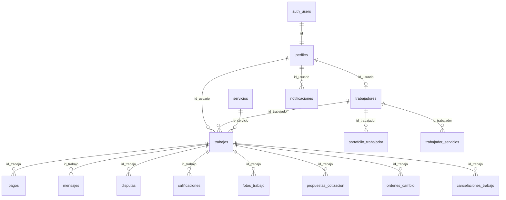

# Diccionario de Base de Datos — MyWorksApp

| Campo | Valor |
|-------|--------|
| Proyecto | MyWorksApp (Supabase `wxqrfcqifkfgawrnqmnj`) |
| Motor | PostgreSQL (Supabase) |
| Convención | español + `snake_case` |
| Estado remoto | Rename ES (`04`) **aplicado**; RLS (`05`) **confirmado** en tablas núcleo; seed marketplace (`06`) en repo |
| Versión documento | **1.3** — 2026-09-14 |
| Tipado | Híbrido: algunos IDs `uuid`, otros `text`; bools como `int` 0/1; fechas a menudo text ISO |

Antes de meterte en las tablas: esto es el “mapa” de la base que usan la app Flutter, la web y el desktop. Si alguien del equipo pregunta “¿dónde se guarda X?” o “¿por qué el rol se llama así?”, la respuesta debería estar acá. Lo técnico lo dejamos tal cual; debajo de cada bloque explico qué significa en la práctica.

Ojo con el tipado híbrido: no todo es `uuid` limpio ni boolean real. Vas a ver `disponible = 1`, fechas como texto ISO, e IDs de trabajo que a veces son `text`. No es un error de naming: el esquema fue creciendo así y las policies RLS comparan casi todo con `::text` para no romper.

## 1. Propósito

Contrato canónico del esquema `public` para las aplicaciones móvil (Flutter), web (React) y escritorio (Tauri/React). Documenta tablas, columnas, códigos de dominio, FKs lógicas, triggers, RLS y consumidores.

En criollo: si cambiás un nombre de columna o un estado (`pendiente` → otra cosa) sin actualizar esto y el código, se rompe el flujo. Este archivo es la referencia compartida para no “inventar” nombres distintos entre apps.

## 2. Diagrama entidad-relación (simplificado)

Cómo se leen las flechas: casi todo parte de `auth.users` → `perfiles`. Si la persona es profesional, tiene fila en `trabajadores`. Cuando alguien pide un servicio nace un `trabajos`, y de ahí cuelgan pagos, chat, disputas, fotos, etc. El diagrama no lista las 28 tablas; es el esqueleto para no perderse.

## 3. Inventario de tablas (28)

Son 28 tablas en `public`. La columna “Origen EN” es el nombre viejo en inglés (antes del rename). Si alguien busca en un tutorial o en un commit viejo `profiles` / `jobs`, acá ve a qué pasó.

| # | Tabla | Origen EN | Propósito |
|---|--------|-----------|-----------|
| 1 | perfiles | profiles | Identidad de app ligada a Auth |
| 2 | trabajadores | workers | Perfil profesional 1:1 |
| 3 | servicios | services | Catálogo de oficios |
| 4 | trabajos | jobs | Solicitud y ciclo de vida |
| 5 | pagos | payments | Escrow / pagos (simulación de pasarela en clientes) |
| 6 | mensajes | messages | Chat por trabajo |
| 7 | disputas | disputes | Conflictos |
| 8 | notificaciones | notifications | Inbox / Realtime |
| 9 | calificaciones | ratings | Puntaje 1–5 |
| 10 | reportes | reports | Denuncias |
| 11 | propuestas_cotizacion | quote_proposals | Cotizaciones |
| 12 | ordenes_cambio | change_orders | Extras / alcance |
| 13 | fotos_trabajo | job_photos | Evidencia media |
| 14 | portafolio_trabajador | worker_portfolio | Galería profesional |
| 15 | trabajador_servicios | worker_services | N:M categorías |
| 16 | cancelaciones_trabajo | job_cancellations | Auditoría de cancelación |
| 17 | registros_error_app | app_error_logs | Errores cliente |
| 18 | eventos_abuso | abuse_events | Antiabuso |
| 19 | acciones_pendientes | pending_actions | Sync offline |
| 20 | bloqueos_usuario | user_blocks | Bloqueos |
| 21 | consentimientos_usuario | user_consents | GDPR / términos |
| 22 | banderas_funcionalidad | feature_flags | Feature flags |
| 23 | suscripciones | subscriptions | Planes |
| 24 | impulsos | boosts | Boost de visibilidad |
| 25 | eventos_analitica | analytics_events | Product analytics |
| 26 | configuraciones_servicio | service_configs | Schema UI servicio |
| 27 | codigos_restablecimiento | password_reset_codes | Reset password app |
| 28 | tickets_soporte | tickets | Soporte / desk |

Las primeras 10 son las que más tocamos día a día (cuenta, oficio, pedido, plata, chat). Del 11 al 16 son del flujo de cotización / evidencia / cancelación. Del 17 al 28 son soporte, compliance, flags y cosas de producto que a veces están medio dormidas en la demo, pero la tabla existe.

## 4. Glosario de códigos

Estos strings viven en columnas `text`. No son enums de Postgres “duros” en todos lados: si mandás un valor inventado, a veces la BD lo acepta y el bug aparece en la UI. Cuando programés un filtro o un `if`, usá exactamente estos valores.

| Dominio | Valores |
|---------|---------|
| Rol | `usuario`, `trabajador`, `administrador` (`is_admin` acepta también `admin`) |
| Estado cuenta | `activo`, `suspendido`, `bloqueado`, `eliminado` |
| Estado trabajo | `pendiente`, `aceptado`, `en_curso`, `completado`, `cancelado`, `expirado`, `no_asistio`, `esperando_pago`, `esperando_cotizaciones`, `cotizacion_seleccionada`, `pausado_orden_cambio`, `esperando_aprobacion_cliente` |
| Estado pago | `ninguno`, `pendiente`, `autorizado`, `retenido`, `liberado`, `reembolsado` |
| Modalidad cobro | `legado`, `precio_fijo`, `bloque_horas`, `cotizacion_abierta` |
| Tipo pago | `principal`, `orden_cambio`, `horas_extra` |
| Disputa estado | `abierta`, `en_revision`, `resuelta` |
| Disputa motivo | `calidad`, `pago`, `conducta`, `otro` |
| Reporte | `pendiente`, `revisado`, `resuelto`, `descartado` |
| Categoría | `construccion`, `plomeria`, `electricidad`, `limpieza`, `ensamblaje`, `soporte_tecnico`, `jardinera`, `mudanza`, `general` |
| Modelo precio | `por_hora`, `fijo`, `por_item` |
| Cotización | `enviada`, `retirada`, `aceptada`, `rechazada` |
| Orden cambio | `pendiente_cliente`, `aprobada`, `rechazada`, `pagada`, `cancelada` |
| Mensaje / medio | `texto`/`imagen` · `foto`/`video` |
| Error / sync | `nuevo`…`ignorado` · `pendiente_sync`…`fallido` |
| Suscripción / impulso | `activa`/`cancelada`/`expirada` · `visibilidad`/`prioridad`/`destacado` |
| Ticket | `pendiente`, `resuelto` |

Cómo lo usamos nosotros:

- **Rol:** el cliente entra como `usuario`, el profesional como `trabajador`, la consola desktop solo deja pasar `administrador`. `is_admin()` también traga `admin` por si quedó algún registro viejo.
- **Estado cuenta:** si no está `activo`, no debería operar normal (login / gates en app).
- **Estado trabajo:** es la máquina de estados del pedido. `pendiente` = recién pedido; `en_curso` = ya están en faena; `esperando_pago` / cotizaciones aparecen en modalidades nuevas de cobro.
- **Estado pago / escrow:** en clientes es simulación académica (no hay pasarela real cobrando). Igual persistimos estados para demostrar el flujo.
- **Categoría:** es el “slug” del oficio (`plomeria`, no “Gasfitería…”). El nombre lindo va en `servicios.nombre`.

## 5. Tablas núcleo

### 5.1 perfiles

Esta es la ficha de la persona en la app. Auth de Supabase te da el usuario; nosotros guardamos acá nombre, correo, rol y si la cuenta está usable. El `id` es el mismo que `auth.users.id`: si no calza, el perfil “no es de ese login”.

| Columna | Tipo lógico | Nulo | Descripción |
|---------|-------------|------|-------------|
| id | uuid (típ.) | No | PK = auth.users.id |
| nombre | text | No | Nombre visible |
| correo | text | No | Email |
| rol | text | No | Ver glosario |
| estado_cuenta | text | No | Ver glosario |
| ruta_foto_perfil | text | Sí | URL/ruta |
| creado_en | text/timestamptz | No | Alta |

**FK:** id → auth.users · **Índice:** idx_perfiles_rol  
**Triggers:** handle_new_user; protect_profiles_sensitive  
**RLS remoto:** `rowsecurity = true` (confirmado 2026-09-14)

`handle_new_user` arma el perfil cuando alguien se registra. `protect_profiles_sensitive` evita que un usuario se autoasigne rol admin u otros campos que no le corresponden. Con RLS, en teoría cada uno ve/edita lo suyo (y el admin más).

### 5.2 trabajadores

No todo `perfiles` es trabajador. Solo si ofrece oficios hay fila acá, 1:1 con el usuario (`id_usuario`). Acá está la bio, si está disponible, la tarifa de visita, la zona, los tiers de precio en JSON, etc. El home del profesional y el listado del marketplace leen fuerte esta tabla.

| Columna | Tipo | Descripción |
|---------|------|-------------|
| id_usuario | PK/FK → perfiles | uuid típ. |
| profesion | text | Oficio |
| descripcion | text | Bio |
| calificacion | numeric | Rating agregado |
| disponible | int 0/1 | Disponibilidad |
| tarifa_visita | numeric | CLP |
| categoria_servicio | text | Categoría |
| niveles_precio | json | Tiers |
| servicios_personalizados | json | Extra |
| precios_configurados | int 0/1 | Setup OK |
| zona_trabajo | text | Zona |
| conteo_rechazos | int | Ranking |

**FK:** trabajadores_id_usuario_fkey  
**RLS remoto:** `rowsecurity = true` (confirmado 2026-09-14)  
**Marketplace (`06`):** `SELECT` permitido a `anon` + `authenticated`

`disponible = 1` quiere decir “me pueden contactar / me muestro disponible”. `precios_configurados = 1` es el flag de que ya pasó el setup de tarifas. `niveles_precio` es JSON a propósito: cada oficio arma packs distintos sin una tabla rígida por ítem.

### 5.3 servicios

Catálogo de oficios que muestra la app (gasfitería, electricidad, etc.). Si esta tabla está vacía, el home del cliente no tiene qué listar aunque haya trabajadores. Por eso existe la migración `06` de seed.

| Columna | Tipo | Descripción |
|---------|------|-------------|
| id | text/uuid | PK |
| nombre | text | Nombre del oficio |
| descripcion | text | Detalle |
| categoria | text | Ver glosario (única lógica de seed) |
| activo | int 0/1 | Visible en catálogo si = 1 |
| requiere_certificacion | int 0/1 | p. ej. electricidad |
| modelo_precio | text | `por_hora` / `fijo` / `por_item` |
| aviso_legal | text | Disclaimer |
| creado_en / actualizado_en | text ISO | Auditoría |

**RLS remoto:** `rowsecurity = true` (confirmado 2026-09-14)  
**Seed (`06`):** 8 categorías (`svc-plomeria` … `svc-construccion`) si la tabla estaba vacía  
**Marketplace:** `SELECT` de activos a `anon`/`authenticated` (sin invocar `is_admin` en policy pública)

`categoria` es la clave estable para joinear / filtrar. `nombre` es lo que lee el usuario. `activo = 0` saca el oficio del catálogo sin borrar la fila. La policy pública no llama a `is_admin()` porque el rol `anon` no puede ejecutar esa función y te revienta con `42501`.

### 5.4 trabajos

El pedido en sí: quién lo pidió, qué profesional quedó asignado (si hay), qué servicio, dirección, estado, modalidad de cobro, etc. Casi todos los flujos “vivos” de la app orbitan esta tabla.

id (a menudo **text**), id_usuario, id_trabajador, id_servicio, estado, direccion, latitud, longitud, descripcion, fecha_programada, metadatos_servicio, modalidad_cobro, estado_pago, id_comuna, instantanea_precio, id_sku_servicio, horas_bloque, id_cotizacion_seleccionada, creado_en, actualizado_en.

**RLS remoto:** `rowsecurity = true` (confirmado 2026-09-14)

`id_usuario` = cliente. `id_trabajador` = profesional (puede ir null mientras está buscando / cotizando). `metadatos_servicio` e `instantanea_precio` guardan el “qué se pactó” para que no dependamos solo del catálogo actual. Si el `id` del trabajo es `text`, no asumas uuid en el código ni en las RPC: por eso `es_parte_trabajo(p_trabajo_id text)`.

### 5.5 pagos

Registro de cobro / escrow ligado a un trabajo. En la demo académica la UI dice simulación: no estamos conectados a Transbank/Stripe cobrando de verdad, pero la fila y los estados sirven para mostrar el flujo (retenido → liberado, etc.).

id_trabajo, tipo_pago, monto, moneda, estado, metodo_pago, id_transaccion, timestamps escrow.

**RLS remoto:** `rowsecurity = true` (confirmado 2026-09-14)  
**Acceso:** solo `authenticated` parte del trabajo o admin (no `anon`)

Si probás con la anon key sin login y te tira 401 o vacío, es esperable. Plata y chat no son catálogo público.

### 5.6–5.10

- **mensajes:** id_trabajo, id_remitente, id_destinatario, contenido, tipo, ruta_imagen, leido, creado_en  
- **disputas:** id_trabajo, abierta_por, motivo, descripcion, estado, resolucion, resuelta_por, resuelta_en  
- **notificaciones:** id_usuario, tipo (códigos evento aún EN), titulo, cuerpo, id_relacionado, leido  
- **calificaciones:** id_trabajo, id_usuario, puntaje 1–5, comentario  
- **reportes:** id_reportante, id_usuario_reportado, motivo, descripcion, estado  

Chat (`mensajes`) es por trabajo, no un inbox global suelto. Disputas las abre una de las partes y las cierra soporte/admin (desktop usa RPC). Notificaciones: el `tipo` todavía puede venir en inglés de cuando el esquema era EN; el resto del esquema ya está en ES. Calificaciones alimentan el `calificacion` del trabajador. Reportes son denuncias entre usuarios para moderación.

## 6. Tablas secundarias

propuestas_cotizacion, ordenes_cambio, fotos_trabajo, portafolio_trabajador, trabajador_servicios, cancelaciones_trabajo, registros_error_app, eventos_abuso, acciones_pendientes, bloqueos_usuario, consentimientos_usuario, banderas_funcionalidad, suscripciones, impulsos, eventos_analitica, configuraciones_servicio, codigos_restablecimiento, tickets_soporte.

La migración `05` habilita RLS en el inventario completo cuando la tabla existe.

Para ubicarlas sin memorizar:

- **propuestas_cotizacion / ordenes_cambio:** precio abierto y “se me pasó el alcance, cobro extra”.
- **fotos_trabajo / portafolio_trabajador:** evidencia del trabajo vs. galería del perfil.
- **trabajador_servicios:** cruza profesional ↔ categorías (N:M).
- **cancelaciones_trabajo:** historial de por qué se cayó un job.
- **registros_error_app / eventos_abuso / acciones_pendientes:** telemetría, antiabuso y cola offline.
- **bloqueos_usuario / consentimientos_usuario:** seguridad interpersonal y GDPR/términos.
- **banderas_funcionalidad / suscripciones / impulsos / eventos_analitica:** producto (flags, planes, boost, analytics).
- **configuraciones_servicio:** cómo se arma el formulario UI por oficio.
- **codigos_restablecimiento:** reset de clave por app (además de lo que haga Auth).
- **tickets_soporte:** mesa de ayuda / desk.

## 7. Seguridad versionada

RLS = Row Level Security: aunque tengas la anon/publishable key, Postgres filtra filas según policies. Sin eso, cualquiera con la key podía leer de más. Las migraciones `05` y `06` son las que dejan esto usable en remoto.

### 7.1 Migración 05 — helpers, RLS, RPC

| Artefacto | Efecto |
|-----------|--------|
| is_admin() | perfiles.rol admin/administrador + cuenta activa; **EXECUTE** solo `authenticated` |
| es_parte_trabajo(text) | Parte del trabajo (cliente/trabajador) o admin; compara IDs con `::text` |
| RLS | ENABLE en hasta 28 tablas; policies por propio / parte / admin |
| admin_metricas_resumen() | JSON métricas; solo admin |
| admin_actualizar_estado_disputa(text,text,text) | Resolución disputa; solo admin |
| handle_new_user / protect_profile_sensitive | Signup seguro + campos sensibles |

**Nota tipado:** las policies usan `columna::text = auth.uid()::text` porque el esquema mezcla uuid y text.

Si llamás las RPC admin sin sesión admin, vas a ver error tipo “Solo administradores” (en HTTP suele ser 400, no 404). 404 sería “la función no está”: ahí falta aplicar `05`.

### 7.2 Confirmación remota RLS (2026-09-14)

Verificado por el equipo en SQL Editor:

| tablename | rowsecurity |
|-----------|-------------|
| pagos | true |
| perfiles | true |
| servicios | true |
| trabajadores | true |
| trabajos | true |

`rowsecurity = true` significa “RLS prendido en esa tabla”. No implica que todas las policies estén perfectas para siempre, pero sí que ya no es tabla abierta sin filtro.

### 7.3 Migración 06 — seed + marketplace

- Inserta 8 oficios si faltan por `categoria`
- `GRANT SELECT` marketplace a `anon`/`authenticated` en `servicios` y `trabajadores`
- `GRANT` de escritura en tablas sensibles **solo** a `authenticated`
- Policy pública de `servicios` **no** llama a `is_admin()` (evita `42501 permission denied for function is_admin` en anon)

La landing web necesita ver catálogo y profesionales sin login. Eso es SELECT de marketplace, no abrir `pagos`/`mensajes` al mundo. Si después de `06` algo de catálogo falla por `is_admin`, reaplicá el bloque de policies de `servicios` del archivo (la versión corregida).

## 8. Consumidores

| App | Uso principal |
|-----|----------------|
| Flutter | Repositories sobre casi todas las tablas; release exige `--dart-define` Supabase |
| Web + shared | Catálogo, trabajadores, trabajos; pagos UI simulada |
| Desktop + shared | Disputas/métricas vía RPC; paneles DEMO etiquetados |

Flutter es el cliente “completo”. Web es marketplace + reserva. Desktop es ops (soporte/ejecutivo) y tiene paneles demo académicos aparte: no los confundás con datos productivos. El paquete `shared` concentra llamadas RPC de métricas/disputas para web/desktop.

## 9. Gaps residuales

Cosas que todavía hay que tener en la cabeza; no son “el diccionario está mal”, son deuda conocida.

| Gap | Severidad | Estado |
|-----|-----------|--------|
| RLS 05 en tablas núcleo | Alta | **Cerrado** (confirmado remoto 2026-09-14) |
| Catálogo `servicios` vacío / policy anon | Alta | Mitigado con `06`; reaplicar fragmento policy si hubo `42501` |
| Tipado híbrido uuid/text | Media | Documentado; dumps CREATE TABLE históricos ausentes |
| Códigos notificación/abuso EN | Baja | Sin migrar a ES |
| service_pricing | Baja | Model sin tabla en rename |
| Flutter key demo en debug | Baja | Release bloquea sin dart-define |

## 10. Referencias

- [mapa_esquema_en_es.md](mapa_esquema_en_es.md) — tabla EN→ES columna por columna  
- [APLICAR_MIGRACION_ES.md](APLICAR_MIGRACION_ES.md) — cómo pegar SQL en el Editor  
- [VERIFICACION_BD_REMOTA.md](VERIFICACION_BD_REMOTA.md) — checklist de verificación  
- Migraciones: `…04_aplicar_rename_es.sql`, `…05_rls…`, `…06_seed_servicios_marketplace.sql`  
- [AUDITORIA_PROYECTO.md](AUDITORIA_PROYECTO.md)  
- Word: `docs/DICCIONARIO_BASE_DATOS.docx`
